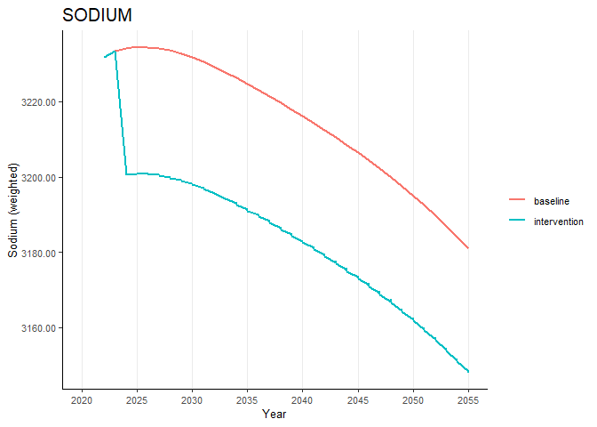
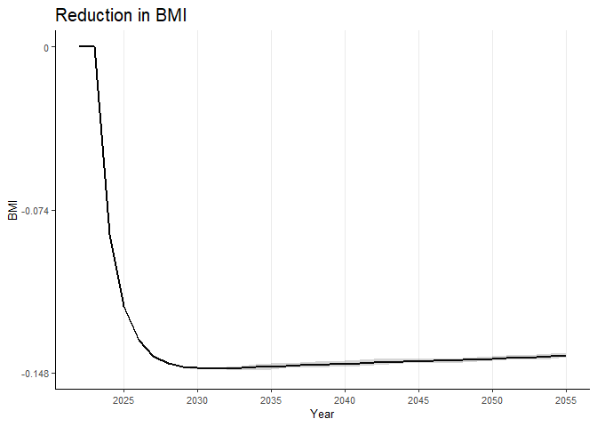

<!-- README.md is generated from README.Rmd. Please edit that file -->

# healthgpsrvis

<!-- badges: start -->

[](https://github.com/imperialCHEPI/healthgpsrvis/actions/workflows/R-CMD-check.yaml)
<!-- badges: end -->

The goal of `healthgpsrvis` is to plot and visualise data related to
Health-GPS.

## Getting Started

### Prerequisites

- [RStudio](https://posit.co/download/rstudio-desktop/) installed
  <!-- - [renv](https://rstudio.github.io/renv/) installed -->

### Installation

You can install the development version of `healthgpsrvis` from
[GitHub](https://github.com/) with:

``` r
# install.packages("devtools")
devtools::install_github("imperialCHEPI/healthgpsrvis")
# devtools::install_github("imperialCHEPI/healthgpsrvis", ref = "branch-name")
```

## Example

This is an example to create the weighted data using the package:

``` r
library(healthgpsrvis)

# Get the path to the .rds file
filepath <- testthat::test_path("testdata", "data_ps3_reformulation")

# Read the .rds file
data <- readRDS(filepath)

# Generate the weighted data
data_weighted <- gen_data_weighted(data)

# Generate the weighted data for the risk factors
data_weighted_rf_wide_collapse <- gen_data_weighted_rf(data_weighted)

# View structure of the weighted data for the risk factors
str(data_weighted_rf_wide_collapse)
#> tibble [34 × 13] (S3: tbl_df/tbl/data.frame)
#>  $ time             : int [1:34] 2022 2023 2024 2025 2026 2027 2028 2029 2030 2031 ...
#>  $ diff_sodium_mean : num [1:34] 0 0 -33.7 -33.7 -33.6 ...
#>  $ diff_sodium_min  : num [1:34] 0 0 -33.7 -33.7 -33.7 ...
#>  $ diff_sodium_max  : num [1:34] 0 0 -33.7 -33.6 -33.5 ...
#>  $ diff_ei_mean     : num [1:34] 0 0 -23.1 -23.1 -23.1 ...
#>  $ diff_ei_min      : num [1:34] 0 0 -23.2 -23.2 -23.2 ...
#>  $ diff_ei_max      : num [1:34] 0 0 -23.1 -23.1 -23.1 ...
#>  $ diff_bmi_mean    : num [1:34] 0 0 -0.0852 -0.1178 -0.133 ...
#>  $ diff_bmi_min     : num [1:34] 0 0 -0.0852 -0.1178 -0.1333 ...
#>  $ diff_bmi_max     : num [1:34] 0 0 -0.0852 -0.1177 -0.1328 ...
#>  $ diff_obesity_mean: num [1:34] 0 0 -0.00258 -0.00363 -0.00419 ...
#>  $ diff_obesity_min : num [1:34] 0 0 -0.0026 -0.00365 -0.00422 ...
#>  $ diff_obesity_max : num [1:34] 0 0 -0.00256 -0.00362 -0.00416 ...
```

To plot a risk factor (say, “bmi”) for the weighted data, you can use
the following code:

``` r
# Plot the risk factor "bmi"
riskfactors("bmi", data_weighted)
```



To plot the difference in the risk factor (say, “bmi”) for the weighted
data, you can use the following code:

``` r
# Plot of difference in the risk factor "bmi"
riskfactors_diff("bmi", 
                 data_weighted_rf_wide_collapse,
                 scale_y_continuous_limits = c(-0.148, 0),
                 scale_y_continuous_breaks = c(-0.148, -0.074, 0),
                 scale_y_continuous_labels = c(-0.148, -0.074, 0))
#> Warning: Use of `data_weighted_rf_wide_collapse$time` is discouraged.
#> ℹ Use `time` instead.
#> Use of `data_weighted_rf_wide_collapse$time` is discouraged.
#> ℹ Use `time` instead.
```



<!--
### Cloning the Repository
&#10;```bash
git clone https://github.com/imperialCHEPI/healthgps-plots.git
cd healthgps-plots
```
&#10;### Setting Up the Project Environment with renv
&#10;1. Activate the renv environment:
```bash
Rscript -e 'renv::activate()'
```
&#10;2. Install project dependencies:
```bash
Rscript -e 'renv::restore()'
```
&#10;### Running the Script
You can now run the visualisation script using:
```bash
Rscript Visualisation.R path/to/HealthGPS_Result_S1.csv path/to/HealthGPS_Result_S2.csv path/to/HealthGPS_Result_S4.csv path/to/HealthGPS_Result_S5.csv
```
&#10;### Updating Dependencies
If you make changes to the project dependencies or want to ensure you have the latest versions, you can update the renv.lock file:
```bash
Rscript -e 'renv::snapshot()'
```
&#10;### Deactivating the renv Environment
After you are done using the project, you can deactivate the renv environment:
```bash
Rscript -e 'renv::deactivate()'
```
-->
