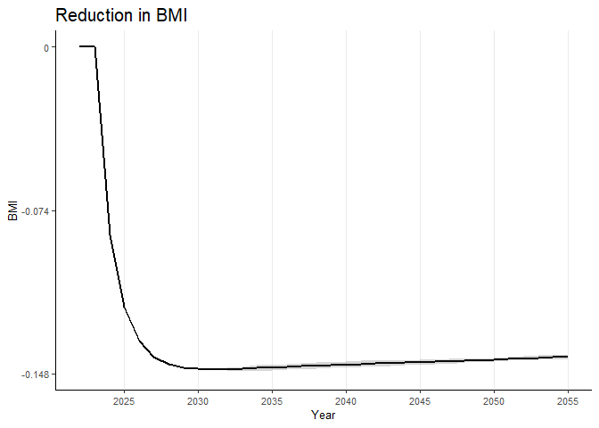
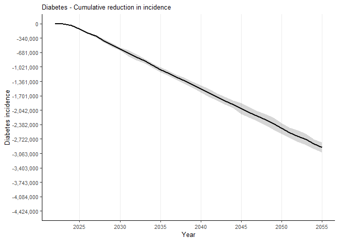

<!-- README.md is generated from README.Rmd. Please edit that file -->

# healthgpsrvis

<!-- badges: start -->

[](https://github.com/imperialCHEPI/healthgpsrvis/actions/workflows/R-CMD-check.yaml)
<!-- badges: end -->

The goal of `healthgpsrvis` is to plot and visualise data related to
Health-GPS.

## Getting Started

### Prerequisites

- [RStudio](https://posit.co/download/rstudio-desktop/) installed
  <!-- - [renv](https://rstudio.github.io/renv/) installed -->

### Installation

You can install the development version of `healthgpsrvis` from
[GitHub](https://github.com/) with:

``` r
# install.packages("devtools")
devtools::install_github("imperialCHEPI/healthgpsrvis")
# devtools::install_github("imperialCHEPI/healthgpsrvis", ref = "branch-name")
```

## Example

This is an example to create the weighted data using the package:

``` r
library(healthgpsrvis)

# Get the path to the .rds file included in the testdata folder
filepath <- testthat::test_path("testdata", "data_ps3_reformulation")
#filepath <- "path/to/data.rds" # Get the path to the .rds file included in any 
#other local folder


# Read the .rds file
data <- readRDS(filepath)

# Generate the weighted data
data_weighted <- gen_data_weighted(data, configname = "default")
#> [1] "Loading the config file..."
#> [1] "Processing the data..."
#> [1] "Data processing complete."

# If you want to use a customised configuration, you will have to change the configname to "production". Then make sure you are editing to use the values (under the `production` field) that you need in the `config.yml` file which is located in the `inst/config` folder.

# Generate the weighted data for the risk factors
data_weighted_rf_wide_collapse <- gen_data_weighted_rf(data_weighted, 
                                                       configname = "default")
#> [1] "Loading the config file..."
#> [1] "Processing the data..."
#> [1] "Data processing complete."

# View structure of the weighted data for the risk factors
str(data_weighted_rf_wide_collapse)
#> gropd_df [170 × 26] (S3: grouped_df/tbl_df/tbl/data.frame)
#>  $ time                              : int [1:170] 2022 2022 2022 2022 2022 2023 2023 2023 2023 2023 ...
#>  $ simID                             : int [1:170] 1 2 3 4 5 1 2 3 4 5 ...
#>  $ weighted_sodium_baseline          : num [1:170] 3232 3232 3232 3232 3232 ...
#>  $ weighted_sodium_intervention      : num [1:170] 3232 3232 3232 3232 3232 ...
#>  $ weighted_energyintake_baseline    : num [1:170] 1917 1917 1917 1917 1917 ...
#>  $ weighted_energyintake_intervention: num [1:170] 1917 1917 1917 1917 1917 ...
#>  $ weighted_bmi_baseline             : num [1:170] 21.5 21.5 21.5 21.5 21.5 ...
#>  $ weighted_bmi_intervention         : num [1:170] 21.5 21.5 21.5 21.5 21.5 ...
#>  $ weighted_obesity_baseline         : num [1:170] 0.0674 0.0675 0.0674 0.0676 0.0674 ...
#>  $ weighted_obesity_intervention     : num [1:170] 0.0674 0.0675 0.0674 0.0676 0.0674 ...
#>  $ diff_sodium                       : num [1:170] 0 0 0 0 0 0 0 0 0 0 ...
#>  $ diff_ei                           : num [1:170] 0 0 0 0 0 0 0 0 0 0 ...
#>  $ diff_bmi                          : num [1:170] 0 0 0 0 0 0 0 0 0 0 ...
#>  $ diff_obesity                      : num [1:170] 0 0 0 0 0 0 0 0 0 0 ...
#>  $ diff_sodium_mean                  : num [1:170] 0 0 0 0 0 0 0 0 0 0 ...
#>  $ diff_ei_mean                      : num [1:170] 0 0 0 0 0 0 0 0 0 0 ...
#>  $ diff_bmi_mean                     : num [1:170] 0 0 0 0 0 0 0 0 0 0 ...
#>  $ diff_obesity_mean                 : num [1:170] 0 0 0 0 0 0 0 0 0 0 ...
#>  $ diff_sodium_ci_low                : num [1:170] NaN NaN NaN NaN NaN NaN NaN NaN NaN NaN ...
#>  $ diff_ei_ci_low                    : num [1:170] NaN NaN NaN NaN NaN NaN NaN NaN NaN NaN ...
#>  $ diff_bmi_ci_low                   : num [1:170] NaN NaN NaN NaN NaN NaN NaN NaN NaN NaN ...
#>  $ diff_obesity_ci_low               : num [1:170] NaN NaN NaN NaN NaN NaN NaN NaN NaN NaN ...
#>  $ diff_sodium_ci_high               : num [1:170] NaN NaN NaN NaN NaN NaN NaN NaN NaN NaN ...
#>  $ diff_ei_ci_high                   : num [1:170] NaN NaN NaN NaN NaN NaN NaN NaN NaN NaN ...
#>  $ diff_bmi_ci_high                  : num [1:170] NaN NaN NaN NaN NaN NaN NaN NaN NaN NaN ...
#>  $ diff_obesity_ci_high              : num [1:170] NaN NaN NaN NaN NaN NaN NaN NaN NaN NaN ...
#>  - attr(*, "groups")= tibble [34 × 2] (S3: tbl_df/tbl/data.frame)
#>   ..$ time : int [1:34] 2022 2023 2024 2025 2026 2027 2028 2029 2030 2031 ...
#>   ..$ .rows: list<int> [1:34] 
#>   .. ..$ : int [1:5] 1 2 3 4 5
#>   .. ..$ : int [1:5] 6 7 8 9 10
#>   .. ..$ : int [1:5] 11 12 13 14 15
#>   .. ..$ : int [1:5] 16 17 18 19 20
#>   .. ..$ : int [1:5] 21 22 23 24 25
#>   .. ..$ : int [1:5] 26 27 28 29 30
#>   .. ..$ : int [1:5] 31 32 33 34 35
#>   .. ..$ : int [1:5] 36 37 38 39 40
#>   .. ..$ : int [1:5] 41 42 43 44 45
#>   .. ..$ : int [1:5] 46 47 48 49 50
#>   .. ..$ : int [1:5] 51 52 53 54 55
#>   .. ..$ : int [1:5] 56 57 58 59 60
#>   .. ..$ : int [1:5] 61 62 63 64 65
#>   .. ..$ : int [1:5] 66 67 68 69 70
#>   .. ..$ : int [1:5] 71 72 73 74 75
#>   .. ..$ : int [1:5] 76 77 78 79 80
#>   .. ..$ : int [1:5] 81 82 83 84 85
#>   .. ..$ : int [1:5] 86 87 88 89 90
#>   .. ..$ : int [1:5] 91 92 93 94 95
#>   .. ..$ : int [1:5] 96 97 98 99 100
#>   .. ..$ : int [1:5] 101 102 103 104 105
#>   .. ..$ : int [1:5] 106 107 108 109 110
#>   .. ..$ : int [1:5] 111 112 113 114 115
#>   .. ..$ : int [1:5] 116 117 118 119 120
#>   .. ..$ : int [1:5] 121 122 123 124 125
#>   .. ..$ : int [1:5] 126 127 128 129 130
#>   .. ..$ : int [1:5] 131 132 133 134 135
#>   .. ..$ : int [1:5] 136 137 138 139 140
#>   .. ..$ : int [1:5] 141 142 143 144 145
#>   .. ..$ : int [1:5] 146 147 148 149 150
#>   .. ..$ : int [1:5] 151 152 153 154 155
#>   .. ..$ : int [1:5] 156 157 158 159 160
#>   .. ..$ : int [1:5] 161 162 163 164 165
#>   .. ..$ : int [1:5] 166 167 168 169 170
#>   .. ..@ ptype: int(0) 
#>   ..- attr(*, ".drop")= logi TRUE
```

To plot a risk factor (say, “bmi”) for the weighted data, you can use
the following code:

``` r
# Plot the risk factor "bmi"
riskfactors("bmi", data_weighted)
```


To plot the difference in the risk factor (say, “bmi”) for the weighted
data, you can use the following code:

``` r
# Plot of difference in the risk factor "bmi"
riskfactors_diff("bmi", 
                 data_weighted_rf_wide_collapse,
                 scale_y_continuous_limits = c(-0.148, 0),
                 scale_y_continuous_breaks = c(-0.148, -0.074, 0),
                 scale_y_continuous_labels = c(-0.148, -0.074, 0))
```



To plot the incidence difference for, say, “stroke”, you can use the
following code:

``` r
data_weighted_ds_wide_diff <- gen_data_weighted_ds_diff(data_weighted, 
                                                        configname = "default")
#> [1] "Loading the config file..."
#> [1] "Processing the data..."
#> [1] "Data processing complete."
inc_diff("stroke", data_weighted_ds_wide_diff)
#> Warning: Removed 170 rows containing missing values or values outside the scale range
#> (`geom_line()`).
```


To plot the cumulative incidence difference for, say, “diabetes”, you
can use the following code:

``` r
data_weighted_ds_wide_collapse <- gen_data_weighted_ds_cumdiff(data_weighted,
                                                               configname = "default")
#> [1] "Loading the config file..."
#> [1] "Processing the data..."
#> [1] "Data processing complete."
inc_cum("diabetes",
    data_weighted_ds_wide_collapse,
    scale_y_continuous_limits = c(-4424000, 0),
    scale_y_continuous_breaks = c(-4424000, -4084000, -3743000, -3403000, -3063000, -2722000, -2382000, -2042000, -1701000, -1361000, -1021000, -681000, -340000, 0),
    scale_y_continuous_labels = scales::comma(c(-4424000, -4084000, -3743000, -3403000, -3063000, -2722000, -2382000, -2042000, -1701000, -1361000, -1021000, -681000, -340000, 0))
  )
```



To plot burden of disease for, say, “yld”, you can use the following
code:

``` r
data_weighted_bd_wide_collapse <- gen_data_weighted_burden(data_weighted,
                                                           configname = "default")
#> [1] "Loading the config file..."
#> [1] "Processing the data..."
#> [1] "Data processing complete."
burden_disease("yld", data_weighted_bd_wide_collapse)
```


<!--
### Cloning the Repository
&#10;```bash
git clone https://github.com/imperialCHEPI/healthgps-plots.git
cd healthgps-plots
```
&#10;### Setting Up the Project Environment with renv
&#10;1. Activate the renv environment:
```bash
Rscript -e 'renv::activate()'
```
&#10;2. Install project dependencies:
```bash
Rscript -e 'renv::restore()'
```
&#10;### Running the Script
You can now run the visualisation script using:
```bash
Rscript Visualisation.R path/to/HealthGPS_Result_S1.csv path/to/HealthGPS_Result_S2.csv path/to/HealthGPS_Result_S4.csv path/to/HealthGPS_Result_S5.csv
```
&#10;### Updating Dependencies
If you make changes to the project dependencies or want to ensure you have the latest versions, you can update the renv.lock file:
```bash
Rscript -e 'renv::snapshot()'
```
&#10;### Deactivating the renv Environment
After you are done using the project, you can deactivate the renv environment:
```bash
Rscript -e 'renv::deactivate()'
```
-->
